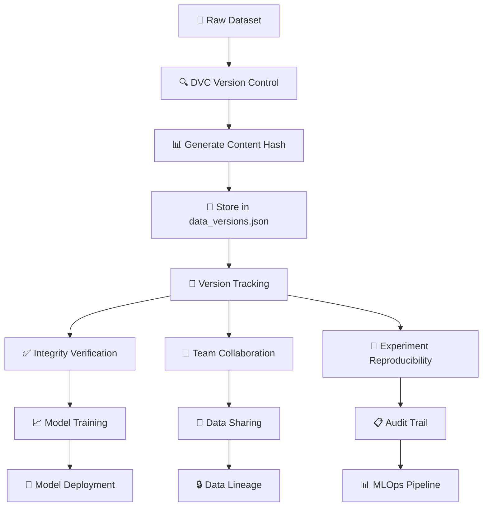
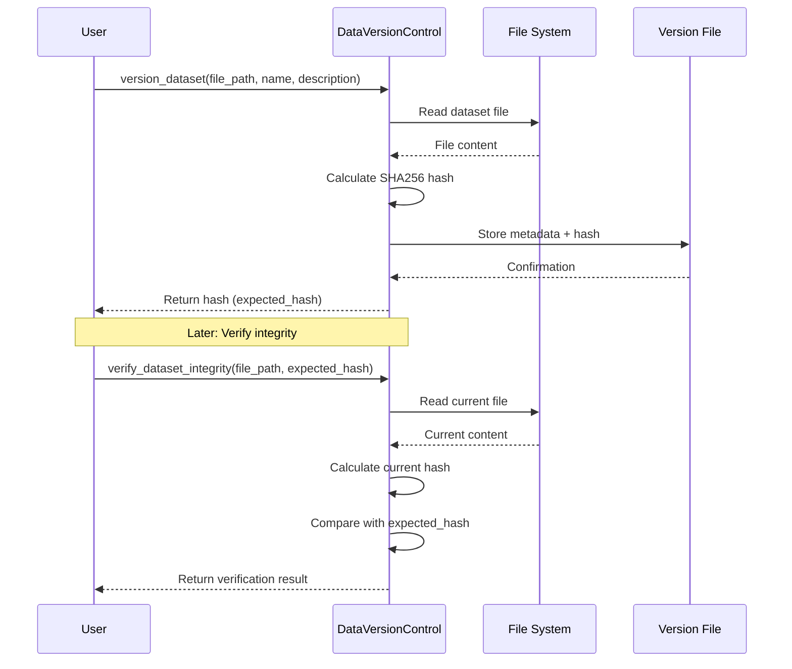
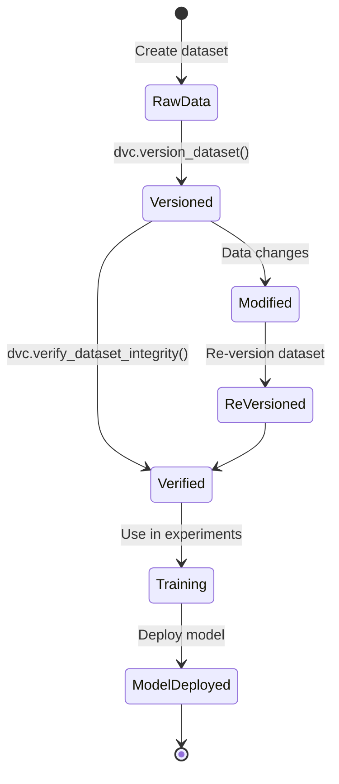
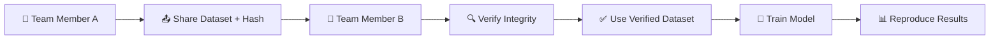
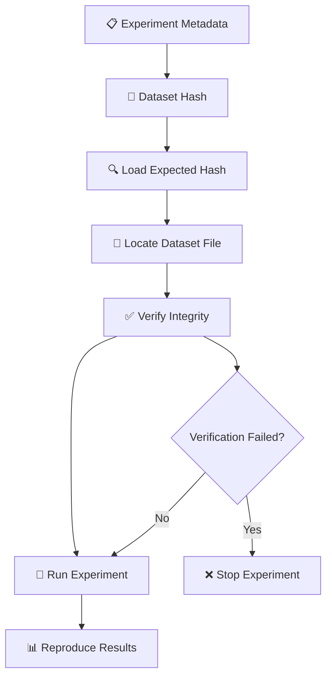
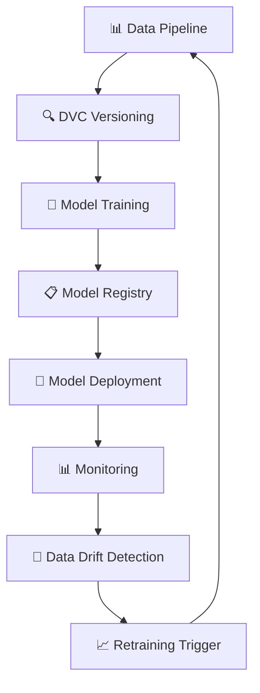
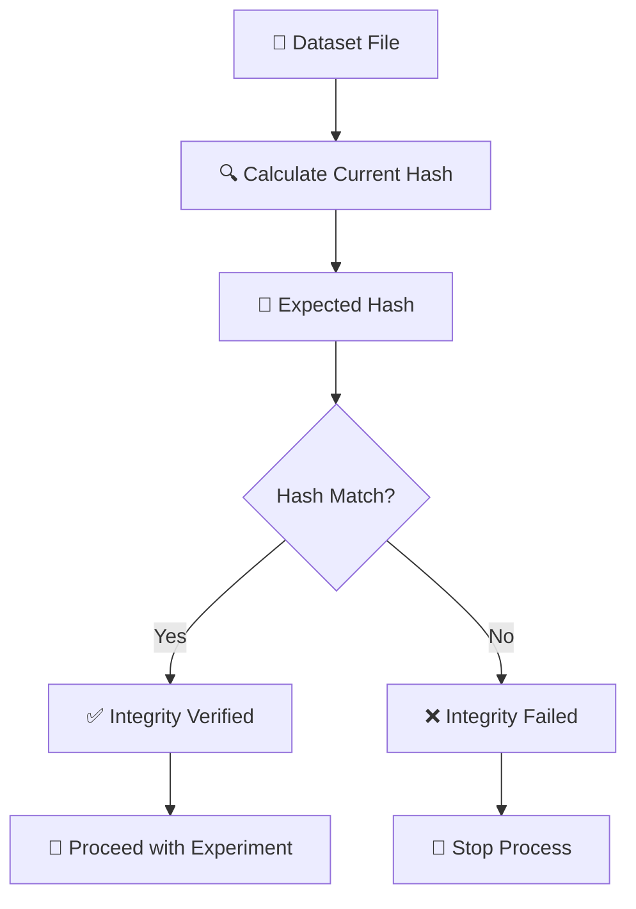

# DVC (Data Version Control) Workflow Diagram

## 🔄 Complete DVC Workflow



## 📊 Data Versioning Process



## 🏗️ Project Structure with DVC

```
Speaking Feedback Tool/
├── 📁 data/
│   ├── 📄 data_versions.json          # DVC Version Registry
│   ├── 📁 raw/
│   │   ├── 📄 emotion_dataset.csv     # Versioned Dataset
│   │   ├── 📄 audio_features.csv      # Versioned Dataset
│   │   └── 📄 validation_data.csv     # Versioned Dataset
│   ├── 📁 processed/
│   │   ├── 📄 emotion_processed.csv   # Versioned Processed Data
│   │   └── 📄 audio_processed.csv     # Versioned Processed Data
│   └── 📁 splits/
│       ├── 📁 emotion_classification/
│       │   ├── 📄 train.csv          # Versioned Split
│       │   ├── 📄 val.csv            # Versioned Split
│       │   └── 📄 test.csv           # Versioned Split
│       └── 📁 validation_testing/
│           ├── 📄 train.csv          # Versioned Split
│           ├── 📄 val.csv            # Versioned Split
│           └── 📄 test.csv           # Versioned Split
├── 📁 models/
│   ├── 📄 model_registry.json        # Model Version Registry
│   └── 📁 custom/
│       ├── 📄 random_forest_emotion_model.pkl
│       ├── 📄 logistic_regression_emotion_model.pkl
│       └── 📄 gradient_boosting_emotion_model.pkl
└── 📁 pipeline_results/
    ├── 📄 pipeline_results_conformer_ctc.json
    ├── 📄 pipeline_results_video_sentiment.json
    └── 📄 pipeline_results_audio_emotion.json
```

## 🔑 Key DVC Concepts

### 1. Content Hashing
```
Input: emotion_dataset.csv (1,000 samples)
Process: SHA256(content)
Output: 9fd78ddf1b085c9dc1caa5451570e12e497ad9360fa6bd00f6e25d300d212203
```

### 2. Version Registry Structure
```json
{
  "9fd78ddf1b085c9d...": {
    "dataset_name": "emotion_classification_data",
    "file_path": "data/raw/emotion_dataset.csv",
    "content_hash": "9fd78ddf1b085c9dc1caa5451570e12e497ad9360fa6bd00f6e25d300d212203",
    "description": "Initial version of emotion classification dataset",
    "tags": ["emotion", "audio", "classification"],
    "created_at": "2025-08-01T15:23:54.265372",
    "file_size": 4153,
    "file_modified": "2025-08-01T15:23:54.265372"
  }
}
```

## 🔄 DVC Workflow States



## 👥 Team Collaboration Flow



## 🔬 Experiment Reproducibility



## 📈 MLOps Integration



## 🎯 Real-World Scenarios

### Scenario 1: New Dataset Creation
```
1. 📁 Create/obtain dataset file
2. 🔍 Call dvc.version_dataset()
3. 🔑 Store returned hash as 'expected_hash'
4. 🤖 Use hash in experiments
```

### Scenario 2: Experiment Reproducibility
```
1. 📋 Load expected hash from experiment metadata
2. 🔍 Call dvc.verify_dataset_integrity()
3. ✅ Only proceed if verification passes
4. 🤖 Run experiment with verified dataset
```

### Scenario 3: Team Collaboration
```
1. 📤 Share dataset file with team
2. 🔑 Share expected hash with team
3. 🔍 Each team member verifies integrity
4. ✅ All use identical dataset version
```

### Scenario 4: Model Deployment
```
1. 📋 Store dataset hash with model metadata
2. 🔍 Verify dataset integrity before deployment
3. 🚀 Deploy model with verified data
4. 📊 Track data lineage for audit
```

## 🔍 Integrity Verification Process



## 📊 Benefits of DVC

### ✅ Data Integrity
- **Prevents silent corruption**: Hash verification catches data changes
- **Ensures reproducibility**: Same hash = same data
- **Provides audit trail**: Track all dataset versions

### ✅ Team Collaboration
- **Centralized versioning**: One source of truth
- **Easy sharing**: Share hash + file
- **Consistent data**: All team members use identical datasets

### ✅ MLOps Best Practices
- **Model versioning**: Link models to specific dataset versions
- **Experiment tracking**: Store dataset hashes with experiments
- **Deployment safety**: Verify data integrity before deployment

### ✅ Compliance & Audit
- **Data lineage**: Track which dataset version was used
- **Reproducibility**: Recreate exact experiment conditions
- **Audit trail**: Complete history of data changes

## 🚀 Next Steps

1. **📊 Real Data Integration**: Replace dummy data with actual datasets
2. **🔗 CI/CD Integration**: Automate DVC verification in pipelines
3. **📈 Advanced Monitoring**: Set up alerts for data drift
4. **👥 Team Workflows**: Implement proper data sharing protocols
5. **🔒 Security**: Add encryption for sensitive datasets

---

*This diagram shows how DVC integrates with the Speaking Feedback Tool to provide robust data versioning, integrity verification, and team collaboration capabilities.* 