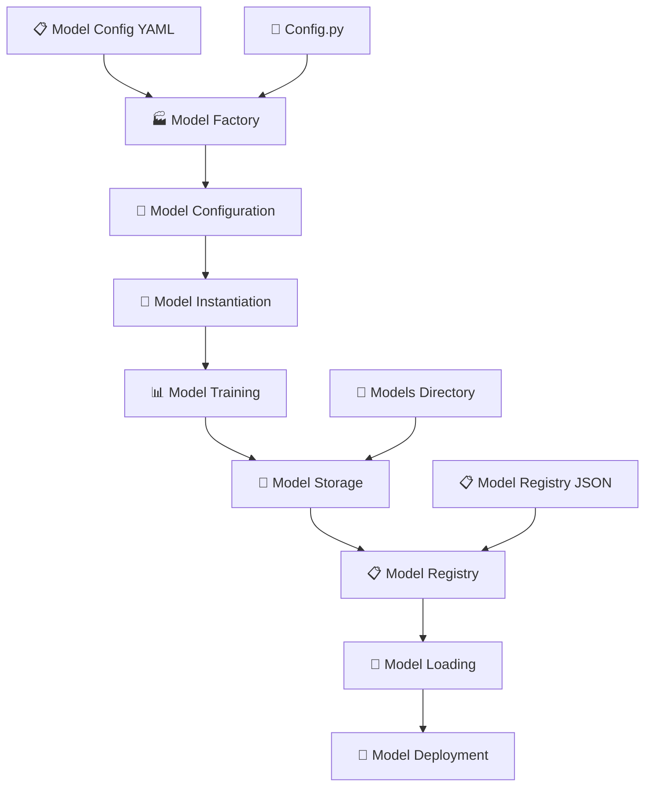
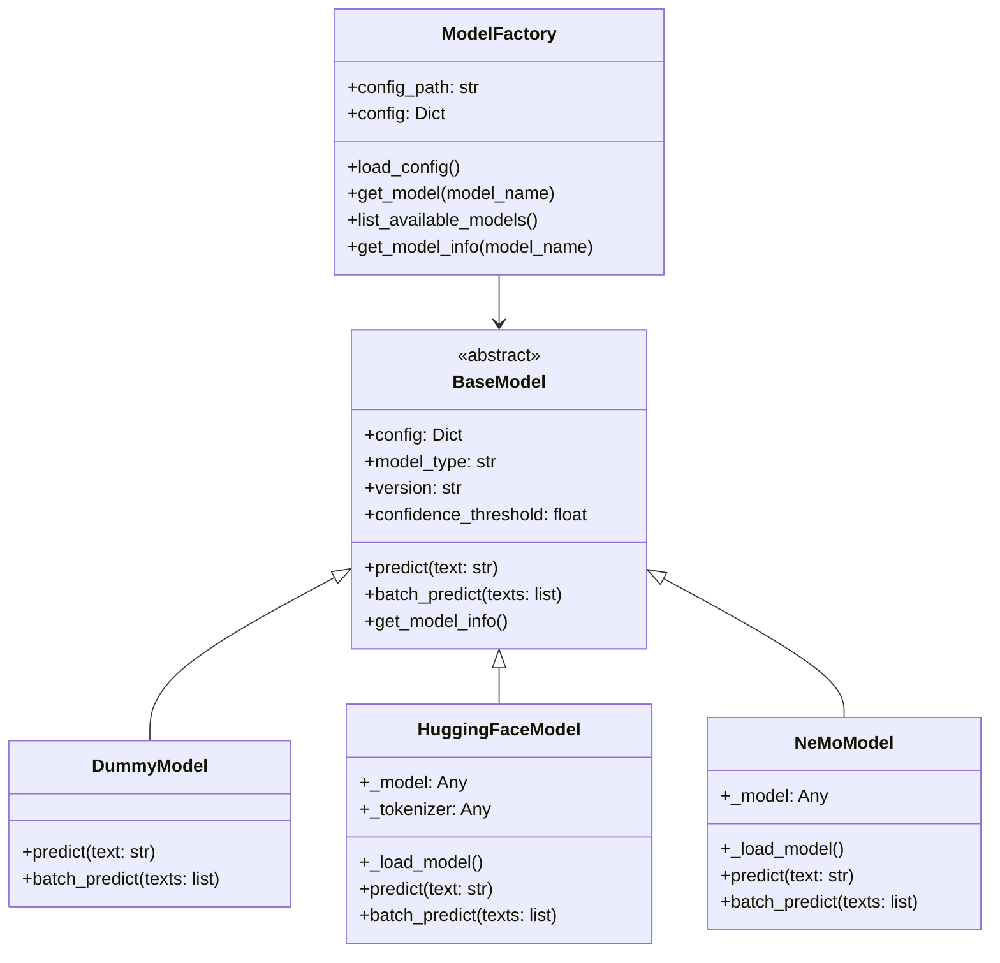
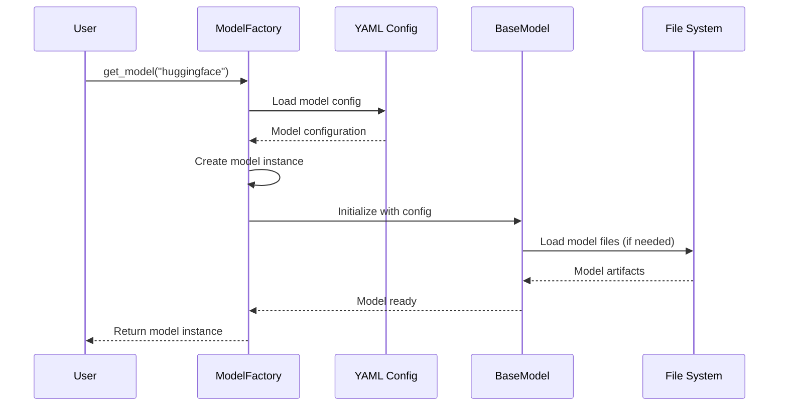
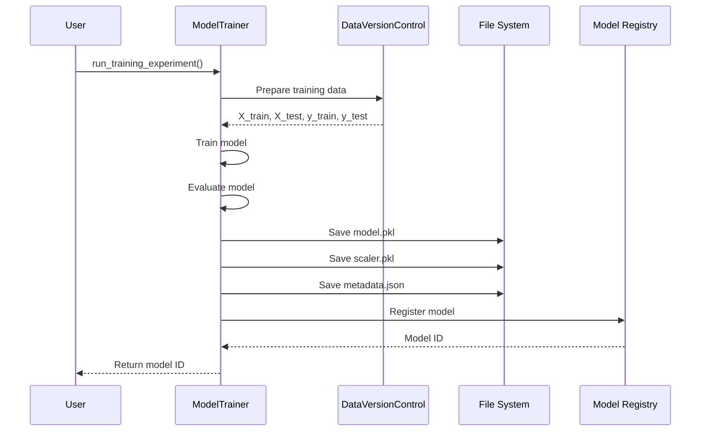
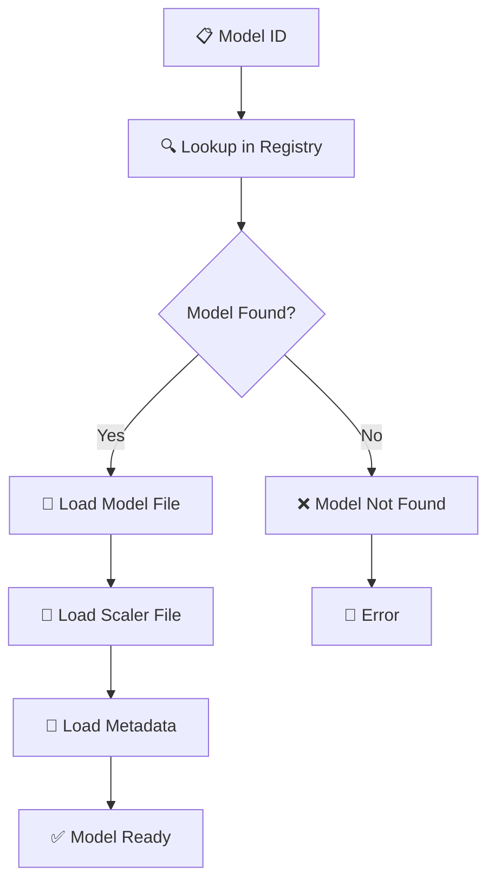
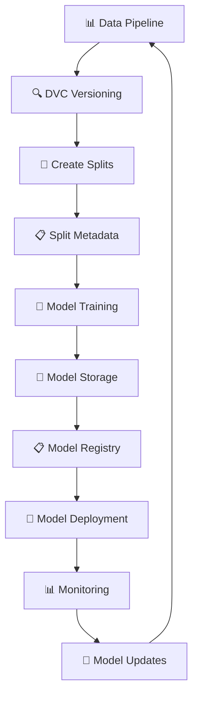

# Model Storage, Loading, and Configuration Workflow

## 🔄 Complete Model Management Workflow



## 🏗️ Model Configuration System

### 1. **YAML Configuration** (`config/models.yaml`)
```yaml
models:
  dummy:
    type: "dummy"
    version: "v1.0"
    confidence_threshold: 0.5
    emotion_labels: ["calm", "anxious", "frustrated", "energetic", "burned_out"]
    description: "Dummy model for testing pipeline functionality"
    
  huggingface:
    type: "huggingface"
    model_name: "cardiffnlp/twitter-roberta-base-sentiment-latest"
    version: "v1.0"
    confidence_threshold: 0.5
    config:
      max_length: 512
      truncation: true
      padding: true
      device: "auto"
      batch_size: 32
      
  audio_emotion:
    type: "audio_emotion"
    model_name: "audio_emotion_classifier"
    version: "v1.0"
    config:
      feature_extractor: "audio_features"
      model_path: "./models/custom/audio_emotion_model.pkl"
      device: "auto"
      sample_rate: 16000

default_model: "dummy"
```

### 2. **Python Configuration** (`config.py`)
```python
class PipelineConfig:
    def __init__(self):
        self.model_config = {
            "model_type": "dummy",
            "version": "v1.0",
            "confidence_threshold": 0.5,
            "sentiment_labels": ["positive", "negative", "neutral", "uncertain"]
        }
        
        self.preprocessing_config = {
            "remove_stop_words": False,
            "lowercase": True,
            "remove_special_chars": True
        }
        
        self.inference_config = {
            "batch_size": 32,
            "enable_metadata": True,
            "add_timestamps": True
        }
```

## 🏭 Model Factory System

### 1. **Model Factory Architecture**


### 2. **Model Loading Process**


## 💾 Model Storage System

### 1. **Model Storage Structure**
```
Speaking Feedback Tool/
├── 📁 models/
│   ├── 📄 model_registry.json          # Model Registry
│   ├── 📁 emotion_classification_test/  # Experiment Directory
│   │   ├── 📄 random_forest_20250801_153009.pkl
│   │   ├── 📄 random_forest_20250801_153009_scaler.pkl
│   │   └── 📄 random_forest_20250801_153009_metadata.json
│   └── 📁 custom/
│       ├── 📄 random_forest_emotion_model.pkl
│       ├── 📄 logistic_regression_emotion_model.pkl
│       └── 📄 gradient_boosting_emotion_model.pkl
├── 📁 config/
│   └── 📄 models.yaml                  # Model Configurations
└── 📁 pipeline_results/
    └── 📄 pipeline_results_*.json
```

### 2. **Model Registry Structure**
```json
{
  "5782fb49-5045-4920-bc25-4e7a7187dd44": {
    "model_name": "random_forest_20250801_153009",
    "experiment_name": "emotion_classification_test",
    "model_path": "models/emotion_classification_test/random_forest_20250801_153009.pkl",
    "metadata_path": "models/emotion_classification_test/random_forest_20250801_153009_metadata.json",
    "accuracy": 0.270,
    "created_at": "2025-08-01T15:30:09.123456"
  }
}
```

### 3. **Model Metadata Structure**
```json
{
  "model_name": "random_forest_20250801_153009",
  "experiment_name": "emotion_classification_test",
  "model_info": {
    "model_type": "random_forest",
    "hyperparameters": {
      "n_estimators": 100,
      "random_state": 42
    }
  },
  "evaluation_results": {
    "accuracy": 0.270,
    "precision": 0.25,
    "recall": 0.27,
    "f1_score": 0.26
  },
  "created_at": "2025-08-01T15:30:09.123456",
  "model_path": "models/emotion_classification_test/random_forest_20250801_153009.pkl",
  "scaler_path": "models/emotion_classification_test/random_forest_20250801_153009_scaler.pkl",
  "metadata_path": "models/emotion_classification_test/random_forest_20250801_153009_metadata.json"
}
```

## 🔄 Model Training and Storage Workflow



## 🔍 Model Loading Process



## 🚀 Model Factory Usage

### 1. **Loading Models**
```python
# Initialize model factory
factory = ModelFactory("config/models.yaml")

# Load specific model
model = factory.get_model("huggingface")

# Load default model
default_model = factory.get_model()

# List available models
available_models = factory.list_available_models()
```

### 2. **Model Configuration**
```python
# Get model configuration
config = factory.get_model_info("huggingface")

# Model configuration includes:
# - Model type and version
# - Confidence threshold
# - Emotion labels
# - Model-specific config (device, batch_size, etc.)
```

### 3. **Model Training and Storage**
```python
# Initialize trainer
trainer = ModelTrainer()

# Run training experiment
model_id = trainer.run_training_experiment(
    dataset_path="data/emotion_dataset.csv",
    model_type="random_forest",
    hyperparameters={"n_estimators": 100}
)

# Load trained model
model, scaler, metadata = trainer.load_model(model_id)
```

## 📊 Model Storage Benefits

### ✅ **Version Control**
- **Model versioning**: Each model gets unique ID
- **Metadata tracking**: Complete model information
- **Reproducible loading**: Exact model state

### ✅ **Experiment Tracking**
- **Experiment organization**: Models grouped by experiment
- **Hyperparameter tracking**: All training parameters stored
- **Evaluation results**: Performance metrics saved

### ✅ **MLOps Best Practices**
- **Model registry**: Centralized model management
- **Artifact management**: Models, scalers, metadata
- **Deployment ready**: Models ready for production

### ✅ **Team Collaboration**
- **Shared models**: Team members can load same models
- **Model sharing**: Share model IDs and metadata
- **Consistent evaluation**: Same models for comparison

## 🎯 Real-World Usage Scenarios

### Scenario 1: Model Training
```
1. 📋 Configure model in YAML
2. 🏭 Initialize model factory
3. 🤖 Train model with data
4. 💾 Save model artifacts
5. 📋 Register in model registry
6. 🔑 Return model ID
```

### Scenario 2: Model Loading
```
1. 🔍 Lookup model in registry
2. 📁 Load model file (.pkl)
3. 📁 Load scaler file (.pkl)
4. 📄 Load metadata (.json)
5. ✅ Return model ready for inference
```

### Scenario 3: Model Deployment
```
1. 📋 Load model by ID
2. 🔍 Verify model integrity
3. 🚀 Deploy model to production
4. 📊 Monitor model performance
```

### Scenario 4: Team Collaboration
```
1. 📤 Share model ID with team
2. 🔍 Team loads same model
3. ✅ All use identical model
4. 📊 Consistent results
```

## 🔑 Core Model Management Functions

```python
# Model Factory
class ModelFactory:
    def get_model(self, model_name: str) -> BaseModel:
        """Load model by name from config"""
        
    def list_available_models(self) -> list:
        """List all available models"""
        
    def get_model_info(self, model_name: str) -> Dict:
        """Get model configuration"""

# Model Trainer
class ModelTrainer:
    def save_model(self, model, model_info, evaluation_results) -> str:
        """Save model with versioning"""
        
    def load_model(self, model_id: str) -> Tuple[Any, Any, Dict]:
        """Load model by ID"""
        
    def list_models(self) -> List[Dict]:
        """List all trained models"""

# Model Registry
class ModelRegistry:
    def register_model(self, model_id: str, metadata: Dict):
        """Register model in registry"""
        
    def get_model_info(self, model_id: str) -> Dict:
        """Get model information"""
        
    def list_models(self) -> List[Dict]:
        """List all registered models"""
```

## 📈 Integration with MLOps Pipeline



## 🚀 Next Steps

1. **📊 Real Model Integration**: Replace dummy models with actual trained models
2. **🔗 CI/CD Integration**: Automate model training and deployment
3. **📈 Advanced Monitoring**: Set up model performance monitoring
4. **👥 Team Workflows**: Implement proper model sharing protocols
5. **🔒 Security**: Add model encryption and access control

---

*This diagram shows how the Speaking Feedback Tool manages model storage, loading, and configuration through a comprehensive MLOps system with model factories, registries, and versioning.* 