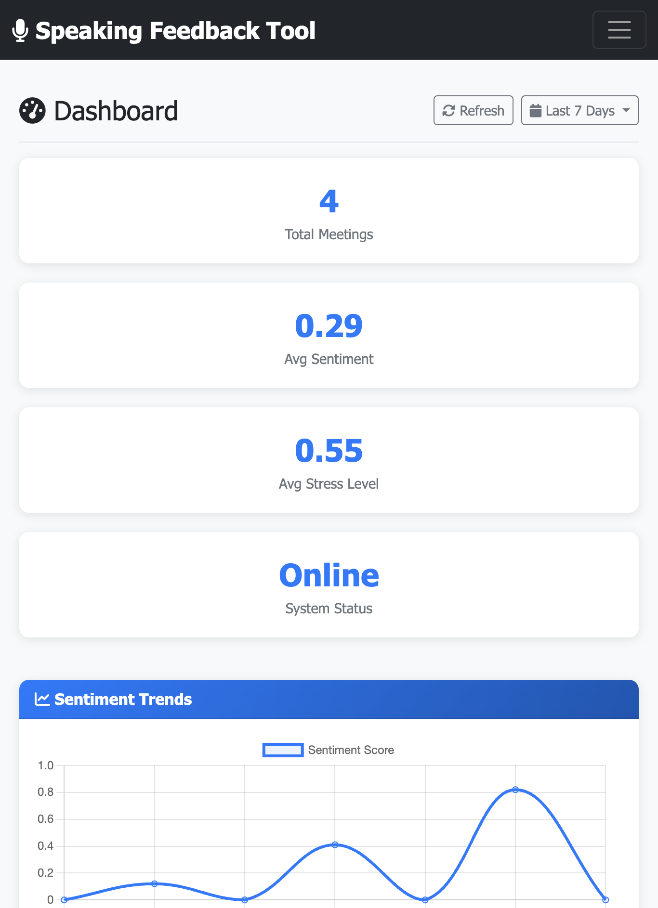
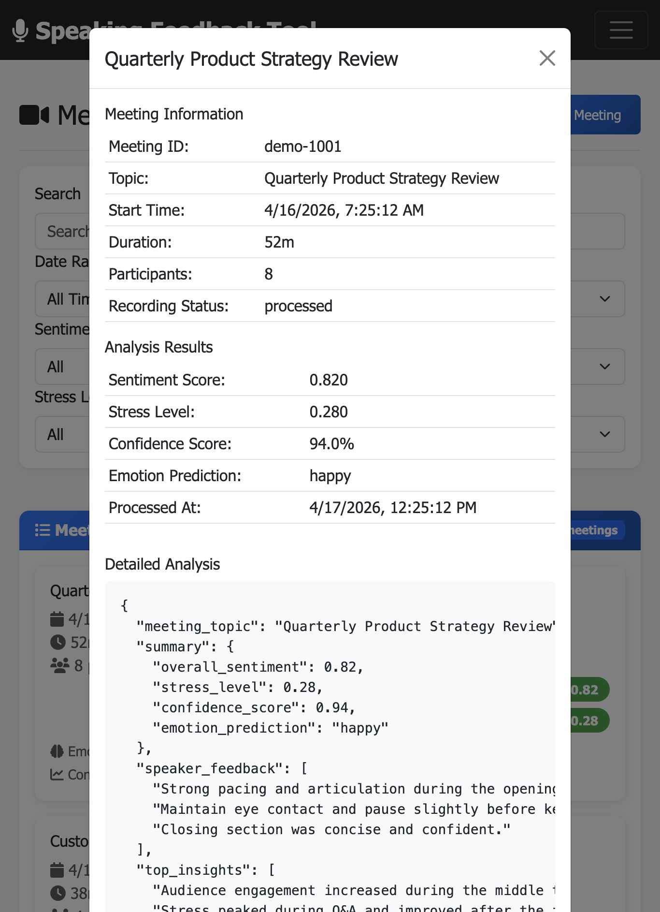
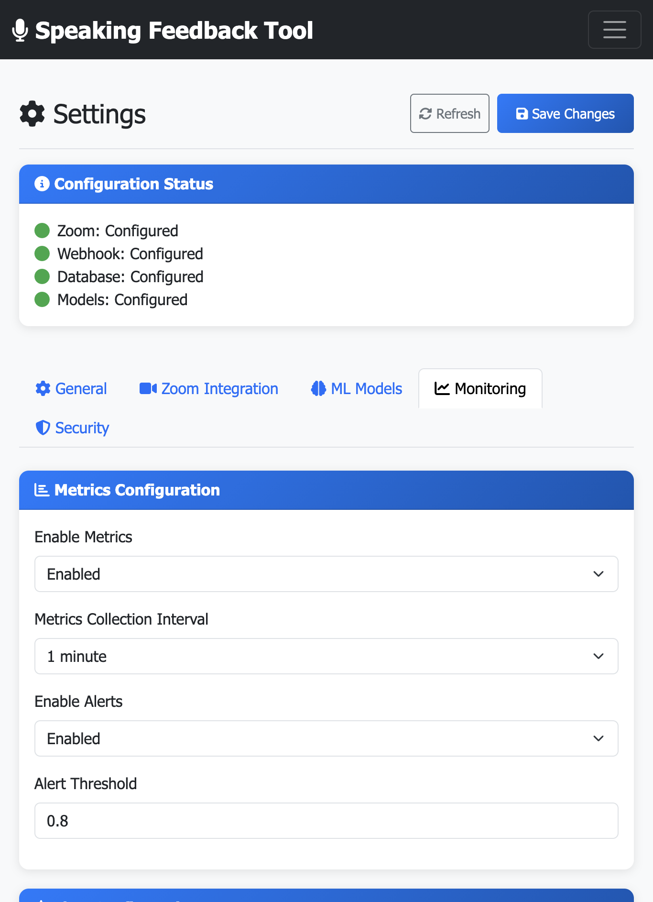

# AI Speaking Feedback Tool (VibeCheck)

**Real-time speaking coach powered by NVIDIA NeMo and Triton Inference Server**  
Automatically processes Zoom meeting recordings via webhooks and delivers instant feedback on tone, sentiment, emotion, and vocal stress.



## Screenshot Gallery

### Dashboard Overview


### Meeting Detail View


### Monitoring Settings


## ✨ Key Features
- **Zoom Webhook Integration**: Real-time processing of `recording.completed` events
- **Multimodal Speech Analysis**: Sentiment, emotion recognition, stress detection using NVIDIA NeMo (Conformer-CTC, QuartzNet) + custom models
- **Production ML Serving**: GPU-accelerated inference with NVIDIA Triton Inference Server
- **Modern Web Dashboard**: Responsive UI with charts, meeting history, trend analytics (Bootstrap 5)
- **Enterprise MLOps**: MLflow, Weights & Biases, DVC data versioning, full experiment tracking
- **Observability**: Prometheus metrics + Grafana dashboards
- **Security & Privacy**: HMAC webhook verification, local processing only, automatic audio cleanup

## 🛠️ Tech Stack
**Backend & API**: Python, Flask  
**ML / MLOps**: NVIDIA NeMo, Triton Inference Server, MLflow, Weights & Biases, DVC, ffmpeg  
**Infrastructure**: Docker, Docker Compose, Kubernetes, GitHub Actions (CI/CD)  
**Monitoring**: Prometheus, Grafana  
**Database**: SQLite  
**Frontend**: Bootstrap 5 + Jinja2 templates

## 🚀 Quick Start (Local)

```bash
git clone https://github.com/HsuJudy/speaking-feedback-tool.git
cd speaking-feedback-tool/vibe-check

cp env_example.txt .env          # Add your Zoom credentials
pip install -r requirements.txt
brew install ffmpeg              # or apt install on Linux

python app.py                    # Runs on http://localhost:5001
```