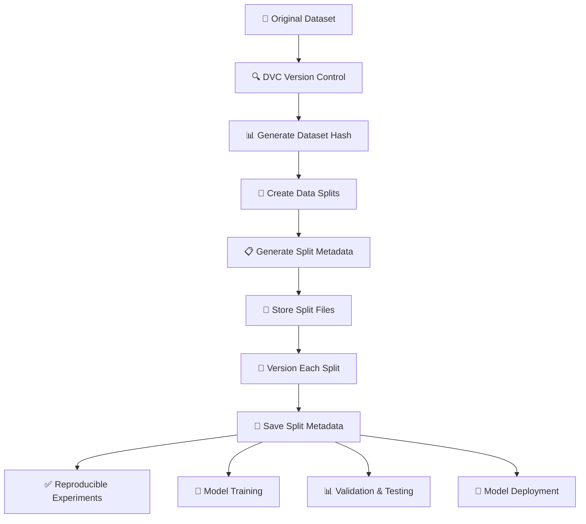
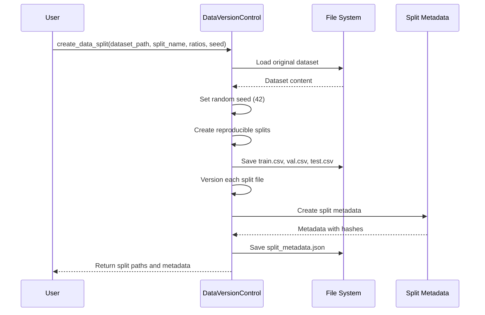
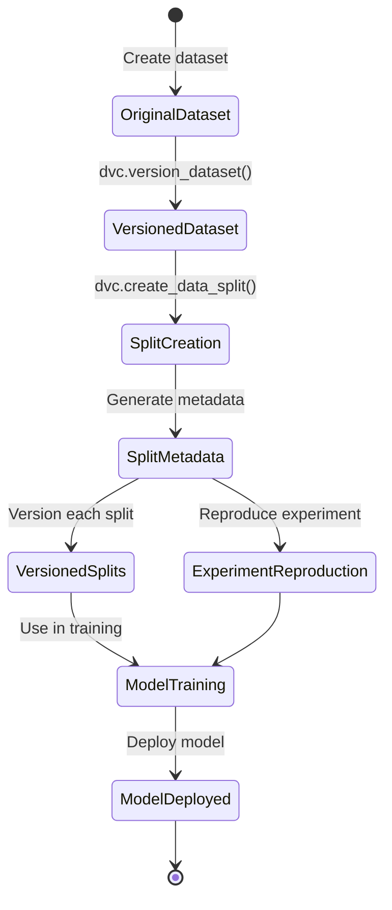
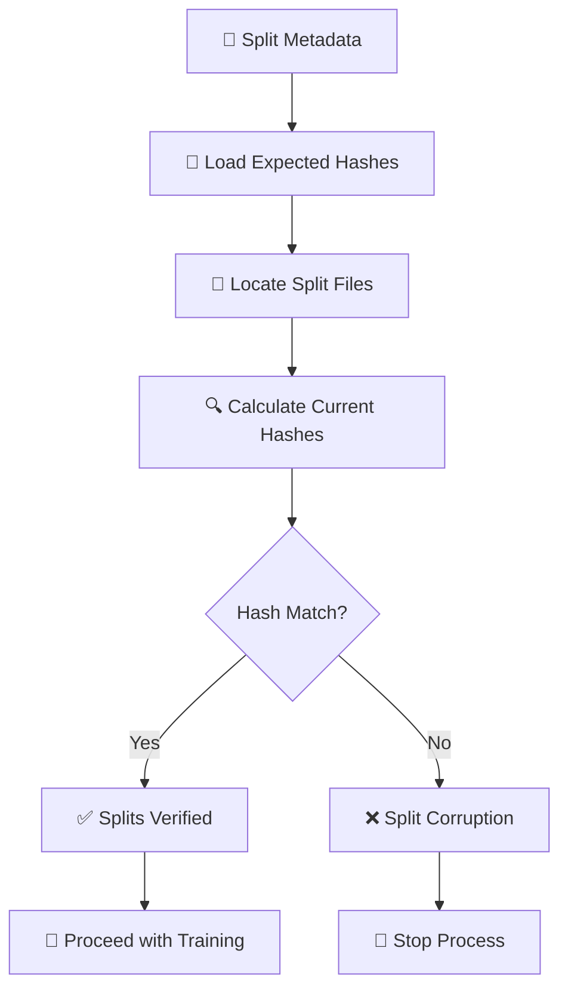
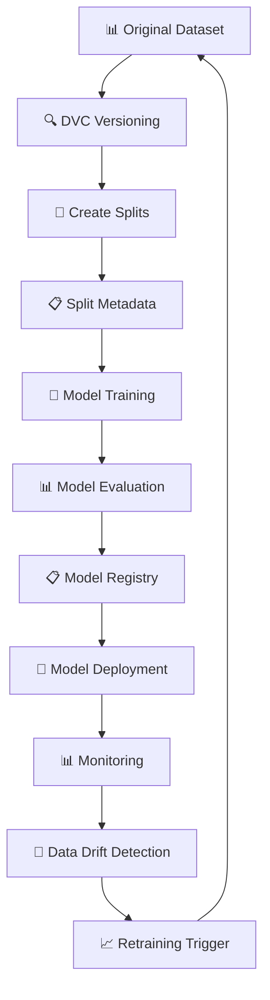

# Split Metadata Workflow Diagram

## 🔄 Complete Split Metadata Workflow



## 📊 Split Metadata Structure

```json
{
  "split_name": "emotion_classification",
  "original_dataset": "demo_data/initial_dataset.csv",
  "train_ratio": 0.7,
  "val_ratio": 0.15,
  "test_ratio": 0.15,
  "random_seed": 42,
  "train_hash": "fd1224a1ccc43d617626288c08cf1196c54569e929998d8cc10f2d824d2f05b8",
  "val_hash": "39afb051edb5e51a909a700533e1ada115a64468cadfb2e8e62134c313c64caf",
  "test_hash": "c73a304d98b462ec5da1c1fbdfcdb7bd24e8e076ee8b11e930c5a77035e4758d",
  "created_at": "2025-08-01T15:23:54.267897"
}
```

## 🔍 Split Metadata Creation Process



## 🏗️ Project Structure with Split Metadata

```
Speaking Feedback Tool/
├── 📁 data/
│   ├── 📄 data_versions.json              # Main DVC Registry
│   ├── 📁 raw/
│   │   └── 📄 emotion_dataset.csv         # Original Dataset
│   └── 📁 splits/
│       ├── 📁 emotion_classification/
│       │   ├── 📄 train.csv              # Training Split
│       │   ├── 📄 val.csv                # Validation Split
│       │   ├── 📄 test.csv               # Test Split
│       │   └── 📄 split_metadata.json    # Split Metadata
│       └── 📁 validation_testing/
│           ├── 📄 train.csv              # Another Split
│           ├── 📄 val.csv
│           ├── 📄 test.csv
│           └── 📄 split_metadata.json    # Another Split Metadata
├── 📁 models/
│   └── 📁 custom/
│       ├── 📄 random_forest_emotion_model.pkl
│       ├── 📄 logistic_regression_emotion_model.pkl
│       └── 📄 gradient_boosting_emotion_model.pkl
└── 📁 pipeline_results/
    └── 📄 pipeline_results_*.json
```

## 🎯 Purpose of Split Metadata

### 1. **Reproducibility**
```
🔑 Same Input + Same Seed = Same Splits
├── Original dataset hash
├── Split ratios (70/15/15)
├── Random seed (42)
└── Individual split hashes
```

### 2. **Data Lineage Tracking**
```
📊 Complete Data Lineage
├── Original dataset → Split metadata
├── Split metadata → Individual splits
├── Individual splits → Model training
└── Model training → Model deployment
```

### 3. **Experiment Reproducibility**
```
🔬 Reproducible Experiments
├── Load split metadata
├── Verify split integrity
├── Use exact same splits
└── Reproduce model results
```

### 4. **Team Collaboration**
```
👥 Team Collaboration
├── Share original dataset + split metadata
├── Each member recreates identical splits
├── All use same train/val/test sets
└── Consistent model evaluation
```

## 🔄 Split Metadata Workflow States



## 🔍 Split Integrity Verification



## 📊 Split Metadata Benefits

### ✅ **Reproducibility**
- **Deterministic splits**: Same seed = same splits
- **No data leakage**: Proper train/val/test separation
- **Experiment reproduction**: Exact same data splits

### ✅ **Data Lineage**
- **Complete tracking**: From original to splits to models
- **Audit trail**: Track which splits were used
- **Version control**: Each split is versioned

### ✅ **Team Collaboration**
- **Shared splits**: All team members use identical splits
- **Consistent evaluation**: Same validation/test sets
- **Easy sharing**: Share metadata + original dataset

### ✅ **MLOps Best Practices**
- **Model versioning**: Link models to specific splits
- **Experiment tracking**: Store split metadata with experiments
- **Deployment safety**: Verify split integrity before deployment

## 🚀 Real-World Usage Scenarios

### Scenario 1: Creating Reproducible Splits
```
1. 📁 Load original dataset
2. 🔍 Version the original dataset
3. 🔄 Create splits with specific ratios
4. 📋 Generate split metadata
5. 💾 Save all split files and metadata
6. 🔑 Version each split individually
```

### Scenario 2: Reproducing Experiments
```
1. 📄 Load split metadata from experiment
2. 🔑 Extract expected split hashes
3. 🔍 Verify split file integrity
4. ✅ Use verified splits for training
5. 🤖 Train model with exact same data
6. 📊 Reproduce model results
```

### Scenario 3: Team Collaboration
```
1. 📤 Share original dataset with team
2. 📄 Share split metadata with team
3. 🔄 Each member recreates splits
4. 🔍 Verify split integrity
5. ✅ All use identical train/val/test sets
6. 🤖 Train models with same data
```

### Scenario 4: Model Deployment
```
1. 📋 Store split metadata with model
2. 🔍 Verify split integrity before deployment
3. 🚀 Deploy model with verified data
4. 📊 Track which splits were used
```

## 🔑 Core Split Metadata Functions

```python
# Create reproducible splits
def create_data_split(dataset_path, split_name, train_ratio=0.7, 
                     val_ratio=0.15, test_ratio=0.15, random_seed=42):
    """
    Creates reproducible data splits with metadata
    """
    # 1. Load original dataset
    # 2. Set random seed for reproducibility
    # 3. Create splits with specified ratios
    # 4. Save split files
    # 5. Version each split
    # 6. Generate split metadata
    # 7. Save metadata file
    # 8. Return split paths and metadata

# Verify split integrity
def verify_split_integrity(split_metadata_path):
    """
    Verifies that split files match metadata hashes
    """
    # 1. Load split metadata
    # 2. Extract expected hashes
    # 3. Calculate current hashes
    # 4. Compare hashes
    # 5. Return verification result

# Reproduce splits
def reproduce_splits(original_dataset_path, split_metadata):
    """
    Reproduces splits from original dataset using metadata
    """
    # 1. Load original dataset
    # 2. Extract split parameters from metadata
    # 3. Set random seed from metadata
    # 4. Create splits with same ratios
    # 5. Verify against metadata hashes
    # 6. Return reproduced splits
```

## 📈 Integration with MLOps Pipeline



## 🎯 Key Split Metadata Concepts

### 1. **Reproducible Splits**
```
Input: emotion_dataset.csv (1,000 samples)
Parameters: train_ratio=0.7, val_ratio=0.15, test_ratio=0.15, seed=42
Output: 
├── train.csv (700 samples)
├── val.csv (150 samples)
├── test.csv (150 samples)
└── split_metadata.json
```

### 2. **Split Metadata Structure**
```json
{
  "split_name": "emotion_classification",
  "original_dataset": "demo_data/initial_dataset.csv",
  "train_ratio": 0.7,
  "val_ratio": 0.15,
  "test_ratio": 0.15,
  "random_seed": 42,
  "train_hash": "fd1224a1ccc43d61...",
  "val_hash": "39afb051edb5e51a...",
  "test_hash": "c73a304d98b462ec...",
  "created_at": "2025-08-01T15:23:54.267897"
}
```

### 3. **Data Lineage Chain**
```
Original Dataset → Split Metadata → Individual Splits → Model Training → Model Deployment
```

## 🚀 Next Steps

1. **📊 Real Data Integration**: Use actual datasets instead of dummy data
2. **🔗 CI/CD Integration**: Automate split verification in pipelines
3. **📈 Advanced Monitoring**: Set up alerts for split drift
4. **👥 Team Workflows**: Implement proper split sharing protocols
5. **🔒 Security**: Add encryption for sensitive split data

---

*This diagram shows how split metadata ensures reproducible data splits and integrates with the overall DVC system for robust MLOps workflows.* 